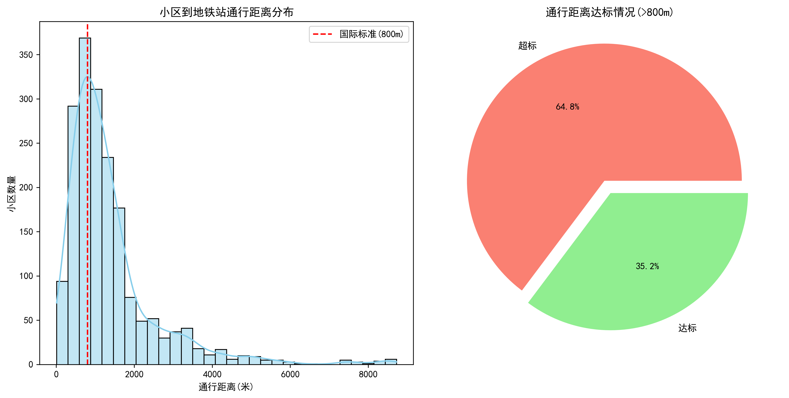
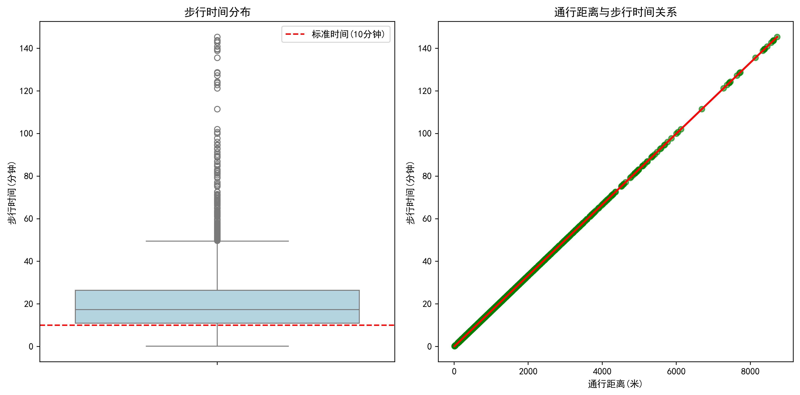
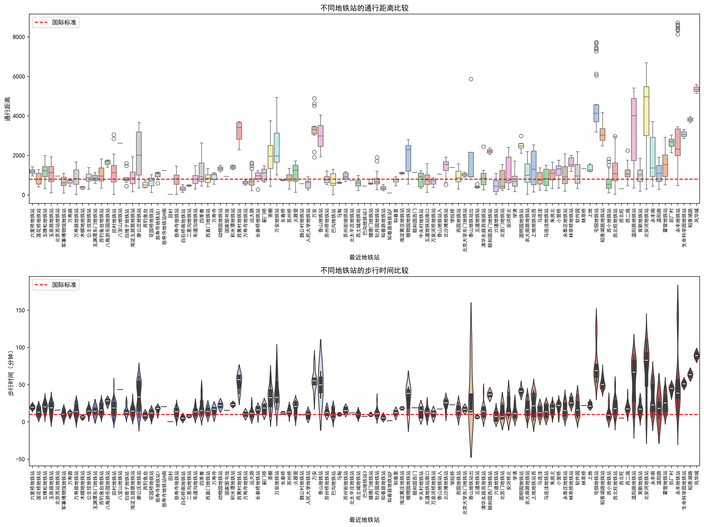
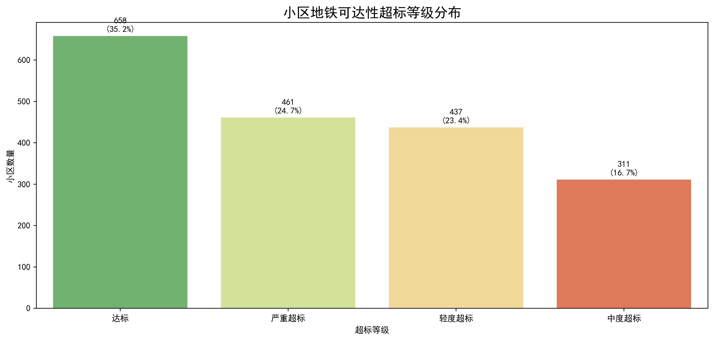

### 小区到地铁站通行距离分布图可以看出，该分布图不是正态分布，大部分通行距离超过标准值，从右边的饼图可以看到，有64.8%地铁通行距离超过了国际标准800米

### 从步行时间分布箱形图可看出，步行时间的中位数，上四分位数，下四分位数均超过了国际标准时间10分钟

### 从上面两幅图可以看出，大部分地铁站的通行距离和通行时间分布均超过了国际标准时间

| 超过800米距离区间 | 超标等级标签 |
| ----------------- | ------------ |
| (-∞, 0]           | 达标         |
| (0, 400]          | 轻度超标     |
| (400, 800]        | 中度超标     |
| (800, +∞)         | 严重超标     |

### 从上述统计结果来看，小区地铁可达性分布中，只有约35%为达标，其余均超标，严重超标超过20%。

| 统计量 | 通行距离    | 步行时间（分钟） | 超标准距离  | 超标准时间  |
| ------ | ----------- | ---------------- | ----------- | ----------- |
| count  | 1867.000000 | 1867.000000      | 1867.000000 | 1867.000000 |
| mean   | 1384.072091 | 23.067868        | 584.072091  | 13.067868   |
| std    | 1220.299892 | 20.338332        | 1220.299892 | 20.338332   |
| min    | 8.126572    | 0.135443         | -791.873428 | -9.864557   |
| 25%    | 656.910627  | 10.948510        | -143.089373 | 0.948510    |
| 50%    | 1039.275247 | 17.321254        | 239.275247  | 7.321254    |
| 75%    | 1586.293325 | 26.438222        | 786.293325  | 16.438222   |
| max    | 8723.419201 | 145.390320       | 7923.419201 | 135.390320  |

### 数据分析结论

通行距离超标严重：

平均通行距离达1384米，远超国际标准800米

64.8%的小区通行距离超过800米标准

最远的小区通行距离达8723米

步行时间过长：

平均步行时间23分钟，超过国际标准(10分钟)

超一半小区步行时间超过10分钟标准

最长的步行时间达145分钟
